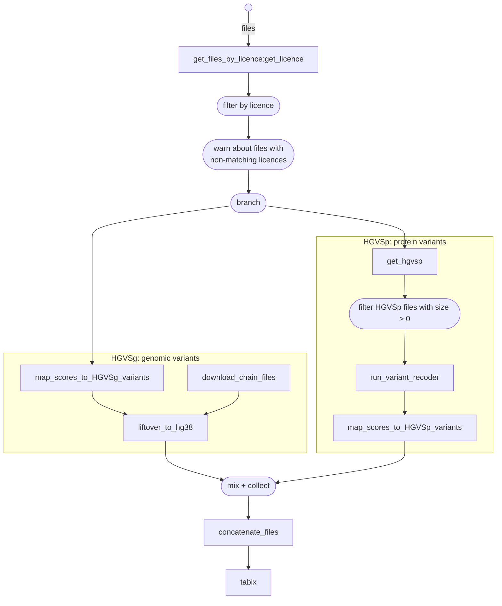

# Create MaveDB plugin data

This Nextflow pipeline creates data for the VEP [MaveDB plugin](https://github.com/Ensembl/VEP_plugins/blob/main/MaveDB.pm).

To generate the plugin data, we require MaveDB mappings. MaveDB scores are automatically downloaded using the [MaveDB API](https://api.mavedb.org/docs).

## Requirements

* [Nextflow 22.04.3](https://nextflow.io/)
* [Singularity](https://docs.sylabs.io/guides/3.5/user-guide/introduction.html)

Any Docker images used are automatically downloaded if using Docker or Singularity. Check [nextflow.config](nextflow.config) for available pre-configured profiles.

## Running the pipeline

Create a folder in your working directory and run:

```bash
[path_to]/ensembl-variation/nextflow/MaveDB/main.nf \
  -profile lsf -resume \
  --mappings [folder_containing_MaveDB_mappings]
```

### Arguments

| Argument     | Description |
| ------------ | ----------- |
| `--mappings` | Path to directory containing MaveDB mapping files in JSON format (mandatory) |
| `--ensembl`  | Path to Ensembl root dir (default: `${ENSEMBL_ROOT_DIR}`) |
| `--output`   | Path to output file (default: `output/MaveDB_variants.tsv.gz`) |
| `--licences` | Comma-separated list of accepted licences (default: `CC0`) |
| `--round`    | Decimal places to round floats in MaveDB data (default: `4`)

## Pipeline steps

1. For each MaveDB mapping file, check if corresponding MaveDB scores file is open-access (licence CC0) using MaveDB API
2. Split MaveDB mapping files by HGVS type: either **HGVSg** or **HGVSp**
3. If HGVSg:
	1. Map MaveDB scores to genomic variants using MaveDB mappings file
        - Scores file is automatically downloaded using MaveDB API
	3. LiftOver to hg38 (if needed)
4. If HGVSp:
	1. Get all unique HGVSp from MaveDB mappings file
	2. Run Variant Recoder (VR) to get possible genomic coordinates for HGVSp
	    - Can take up to 6 hours + 70 GB of RAM for a single run with many HGVSp
	    - Given that it uses the online Ensembl database, it may fail due to too many connections
	4. Map MaveDB scores to genomic variants using VR output and MaveDB mappings file
	    - Scores file is automatically downloaded using MaveDB API
5. Concatenate all output files into a single file
6. Sort, bgzip and tabix

Notes:
- The MaveDB API may return `502: Proxy error` when under stress, resulting in failed jobs.
- Variant Recoder uses an online connection to Ensembl database that can refuse if we ask for too many connections.

## Pipeline diagram


