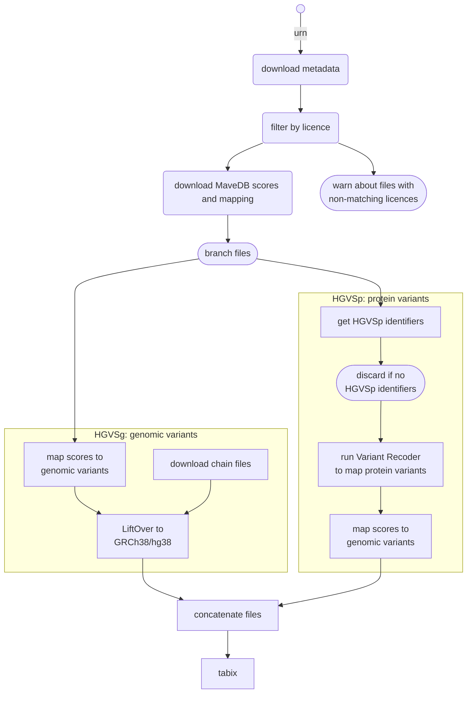

# Create MaveDB plugin data

This Nextflow pipeline prepares data for the VEP [MaveDB plugin][].

The pipeline requires a list of MaveDB URNs. MaveDB mappings and scores are
automatically downloaded using the [MaveDB API][] and then MaveDB data is mapped
to genomic variants using:
- [pyliftover][] to convert genomic coordinates to GRCh38/hg38
- [Variant Recoder][] to map protein variants

By default, containers are downloaded to perform all actions, so there is no
need to install extra software.

[MaveDB plugin]: https://github.com/Ensembl/VEP_plugins/blob/main/MaveDB.pm
[MaveDB API]: https://api.mavedb.org/docs
[pyliftover]: https://pypi.org/project/pyliftover
[Variant Recoder]: https://www.ensembl.org/info/docs/tools/vep/recoder

## Requirements

* [Nextflow 22.04.3](https://nextflow.io/)
* [Singularity](https://docs.sylabs.io/guides/3.5/user-guide/introduction.html)

Any Docker images used are automatically downloaded if using Docker or Singularity. Check [nextflow.config](nextflow.config) for available pre-configured profiles.

## Running the pipeline

Create a file listing the MaveDB URNs to process, such as:

```
urn:mavedb:00000001-a-1
urn:mavedb:00000001-b-1
urn:mavedb:00000001-b-2
urn:mavedb:00000002-a-1
urn:mavedb:00000003-a-1
urn:mavedb:00000003-b-1
```

Run this pipeline with that file:

```bash
nextflow run [path_to]/ensembl-variation/nextflow/MaveDB/main.nf \
  -profile slurm -resume \
  --urn urn.txt
```

### Arguments

| Argument     | Description |
| ------------ | ----------- |
| `--urn`      | Path to file listing MaveDB URNs (mandatory) |
| `--ensembl`  | Path to Ensembl root directory (default: `${ENSEMBL_ROOT_DIR}`) |
| `--output`   | Path to output file (default: `output/MaveDB_variants.tsv.gz`) |
| `--registry` | Path to Ensembl registry file used for [Variant Recoder][] (default: none) |
| `--licences` | Comma-separated list of accepted licences (default: `CC0`) |
| `--round`    | Decimal places to round floats in MaveDB data (default: `4`)

## Pipeline steps

1. For each MaveDB URN, download respective metadata and check if it is using open-access licence (CC0 by default)
2. Split MaveDB mapping files by HGVS type: either **HGVSg** or **HGVSp**
3. If HGVSg:
	1. Map MaveDB scores to genomic variants using MaveDB mappings file
      - Scores file is automatically downloaded using MaveDB API
	3. LiftOver genomic coordinates to GRCh38/hg38 (if needed) with [pyliftover][]
4. If HGVSp:
	1. Get all unique HGVSp from MaveDB mappings file
	2. Run [Variant Recoder][] (VR) to get possible genomic coordinates for HGVSp
	    - Can take up to 6 hours + 70 GB of RAM for a single run with many HGVSp
	    - Given that it uses the online Ensembl database, it may fail due to too many connections
	4. Map MaveDB scores to genomic variants using VR output and MaveDB mappings file
	    - Scores file is automatically downloaded using MaveDB API
5. Concatenate all output files into a single file
6. Sort, bgzip and tabix

Notes:
- The MaveDB API may return `502: Proxy error` when under stress, resulting in failed jobs.
- [Variant Recoder][] uses an online connection to Ensembl database that can refuse if we ask for too many connections.

## Pipeline diagram


