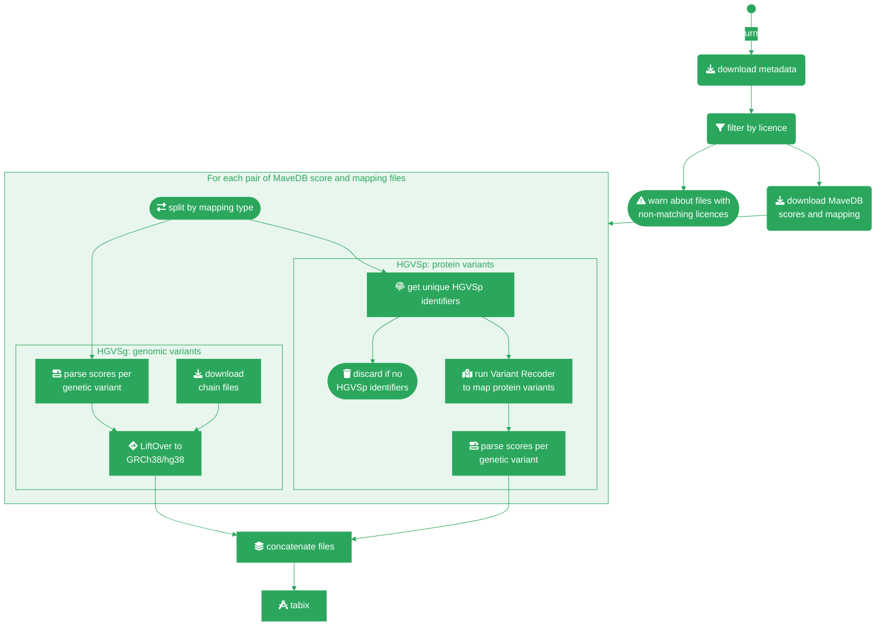

# Create MaveDB plugin data

This Nextflow pipeline prepares data for the VEP [MaveDB plugin][].

The pipeline input is a list of MaveDB URN IDs and the MaveDB data can be supplied to the plugin in one of two ways:

1. **Recommended**: [Download](https://zenodo.org/records/14172004) the MaveDB data and pass it to the pipeline. Uncompress the data dump and pass the directory containing the scores CSV files to `--scores_path`, the directory containing the mappings JSON files to `--mappings_path` and the path to `main.json` to `--metadata_file`. Set the `--from-files` flag to `true`.
2. It is also possible to download the data from the MaveDB API. Set the `--from-files` flag to `false`. This is not reccomended as it can be unstable.

MaveDB data is mapped to genomic variants using:

- [pyliftover][] to convert genomic coordinates to GRCh38/hg38
- [Variant Recoder][] to map protein variants

By default, containers are downloaded to perform all actions, so there is no
need to install extra software.

[MaveDB plugin]: https://github.com/Ensembl/VEP_plugins/blob/main/MaveDB.pm
[MaveDB API]: https://api.mavedb.org/docs
[pyliftover]: https://pypi.org/project/pyliftover
[Variant Recoder]: https://www.ensembl.org/info/docs/tools/vep/recoder

## Requirements

- [Nextflow 22.04.3](https://nextflow.io/)
- [Singularity](https://docs.sylabs.io/guides/3.5/user-guide/introduction.html)
- [pandas](https://pandas.pydata.org/)

Any Docker images used are automatically downloaded if using Docker or Singularity. Check [nextflow.config](nextflow.config) for available pre-configured profiles.

## Running the pipeline

Create a file listing the MaveDB URNs to process, such as:

```
urn:mavedb:00000001-a-1
urn:mavedb:00000001-b-1
urn:mavedb:00000001-b-2
urn:mavedb:00000002-a-1
urn:mavedb:00000003-a-1
urn:mavedb:00000003-b-1
```

Run this pipeline with that file:

```bash
# If pre-downloading the data
nextflow run [path_to]/ensembl-variation/nextflow/MaveDB/main.nf \
  -profile slurm -resume \
  --urn urn.txt \
  --previous_urn processed_urns.txt \
  --previous_output previous_run_output.tsv.gz \
  --from-files true \
  --mappings_path [path_to]/mappings \
  --scores_path [path_to]/scores \
  --metadata_file [path_to]/main.json

# If downloading the data via the MaveDB API
nextflow run [path_to]/ensembl-variation/nextflow/MaveDB/main.nf \
  -profile slurm -resume \
  --urn urn.txt \
  --from-files false
```

If both `--previous_urn` and `--previous_output` are provided, URNs listed in `--previous_urn` are skipped, and their rows are pulled from `--previous_output` and merged with the newly processed URNs so the final output still covers every URN in the current `--urn` file.

### Arguments

| Argument          | Description                                                                                |
| ----------------- | ------------------------------------------------------------------------------------------ |
| `--urn`           | Path to file listing MaveDB URNs (mandatory)                                               |
| `--ensembl`       | Path to Ensembl root directory (default: `${ENSEMBL_ROOT_DIR}`)                            |
| `--output`        | Path to output file with a `.gz` extension (default: `output/MaveDB_variants.tsv.gz`)                             |
| `--registry`      | Path to Ensembl registry file used for [Variant Recoder][] (default: none)                 |
| `--licences`      | Comma-separated list of accepted licences (default: `CC0`)                                 |
| `--round`         | Decimal places to round floats in MaveDB data (default: `4`)                               |
| `--from_files`    | Use local files instead of downloading via the MaveDB API (default: true, this is advised) |
| `--previous_urn`  | Path to a file of URNs already processed; any URN present is skipped                       |
| `--previous_output` | Path to the output (`.tsv.gz`) from a previous run; rows for skipped URNs are merged back into the new output |
| `--mappings_path` | Path to MaveDB mappings files (one JSON file per URN)                                      |
| `--scores_path`   | Path to MaveDB scores files (one CSV file per URN)                                         |
| `--metadata_file` | Path to MaveDB metadata file (one collated file, i.e. main.json)                           |

## Pipeline steps

1. For each MaveDB URN, load or download respective metadata and check if it is using open-access licence (CC0 by default).
2. Split MaveDB mapping files by HGVS type: either **HGVSg** or **HGVSp**.
3. Load or download scores and mappings files using MaveDB API.
4. For each pair of scores and mappings files:
   - If genomic variants (HGVSg):
     - Map MaveDB scores to genomic variants using MaveDB mappings file.
     - LiftOver genomic coordinates to GRCh38/hg38 (if needed) with [pyliftover][].
   - If protein variants (HGVSp):
     - Get all unique HGVSp from MaveDB mappings file.
     - Run [Variant Recoder][] (VR) to get possible genomic coordinates for HGVSp.
       - Can take up to 6 hours + 70 GB of RAM for a single run with many HGVSp.
       - Given that it uses the online Ensembl database, it may fail due to too many connections.
     - Map MaveDB scores to genomic variants using VR output and MaveDB mappings file.
5. Concatenate all output files into a single file.
6. Sort, bgzip and tabix.

The pipeline output is: MaveDB_variants.tsv.gz and MaveDB_variants.tsv.gz.tbi.

Notes:

- If running in API mode, the MaveDB API may return `502: Proxy error` when under stress, resulting in failed jobs.
- [Variant Recoder][] uses an online connection to Ensembl database that can refuse if we ask for too many connections.

## Pipeline diagram


