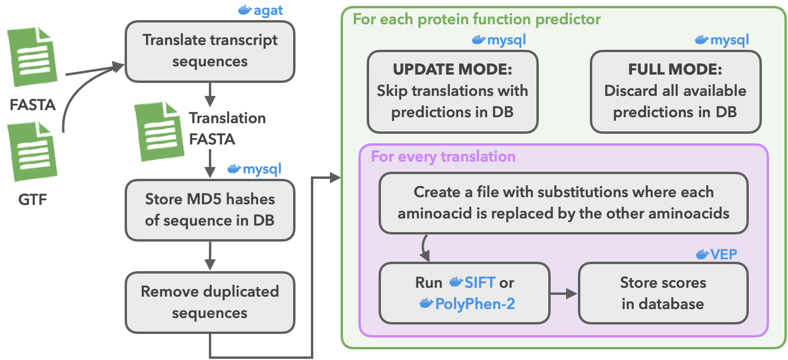

# Predict protein function using SIFT and PolyPhen-2

Alternative to [ProteinFunction eHIVE pipeline][eHIVE] to predict single amino
acid substitutions (SAAS) using SIFT (for multiple species) and PolyPhen-2
(for human only).



From a FASTA and a GTF file, the workflow translates the transcript sequences
using AGAT. MD5 hashes will be created to uniquely identify each translation.

This workflow computes predictions for every possible SAAS in the proteome by
calculating the prediction from each tool for all 19 possible alternate amino
acids at every peptide position in every protein.

There are three modes of actions for SIFT (`sift_run_type`) and PolyPhen-2
(`pph_run_type`):
- `NONE` where no translations are computed for the selected program.
- `UPDATE` where translations in the database are skipped and thus we only
predict the remaining ones.
- `FULL` where the translations in the database are removed and all translations
are predicted from scratch.

After running the protein function predictors, their results are saved in
space-efficient serialised matrices in the database, one matrix per protein. For
each position in the protein sequence (rows) and for each amino acid
substitution (column), we store the scores and predictions. More information on
the matrix format is available in [Ensembl documentation][matrix].

These scores and predictions are displayed in VEP and the Ensembl website.

[matrix]: https://www.ensembl.org/info/genome/variation/prediction/protein_function.html#nsSNP_data_format
[eHIVE]: https://github.com/Ensembl/ensembl-variation/tree/release/107/modules/Bio/EnsEMBL/Variation/Pipeline/ProteinFunction

## Requirements

- [Nextflow 22.04.3](https://nextflow.io)
- Docker images:
  - SIFT
  - PolyPhen-2
  - [Ensembl VEP](https://hub.docker.com/r/ensemblorg/ensembl-vep)
  - [AGAT](https://quay.io/repository/biocontainers/agat)

The images are automatically downloaded if using Docker or Singularity.
Check [nextflow.config](nextflow.config) for available pre-configured profiles.

## Running this workflow

```
nextflow run main.nf -profile lsf -resume \
         --species homo_sapiens \
         --gtf [path/to/gtf] --fasta [path/to/fasta] \
         --pph_run_type UPDATE --pph_data [path/to/pph_data] \
         --sift_run_type UPDATE --blastdb [path/to/blastdb] \
         --host [h] --port [p] --user [u] --pass [p] --database [db]
```

## Arguments

**Available arguments:**
| Argument          | Description                                     |
| ----------------- | ----------------------------------------------- |
| `--gtf`           | Annotation GTF file (required with FASTA)       |
| `--fasta`         | Genomic sequence FASTA file (required with GTF) |
| `--translated`    | FASTA file with peptide sequences; can be used instead of supplying `--gtf` and `--fasta` |
| `--outdir`        |       Name of output dir (default: `outdir`)    |
| `--species`       | Latin species name (default: `homo_sapiens`); PolyPhen-2 only works for human |

**Database options (mandatory):**
| Argument     | Description              |
| ------------ | ------------------------ |
| `--host`     | Database server host     |
| `--port`     | Database server port     |
| `--user`     | Database server user     |
| `--pass`     | Database server password |
| `--database` | Database name            |

**SIFT options:**
| Argument | Description |
| -------- | ----------- |
| `--sift_run_type` | SIFT run type:<br/>- `FULL` to run for all translations<br/>- `UPDATE` to run for new/changed translations<br/>- `NONE` to exclude this analysis (default) |
| `--blastdb`       | SIFT-formatted BLAST database directory (e.g., `uniref100`) |
| `--median_cutoff` | Protein alignment's median cutoff. Default: 2.75            |

**PolyPhen-2 options:**
| Argument | Description |
| -------- | ----------- |
| `--pph_run_type` | PolyPhen-2 run type:<br/>- `FULL` to run for all translations<br/>- `UPDATE` to run for new/changed translations<br/>- `NONE` to exclude this analysis (default) |
| `--pph_data`     | Path to PolyPhen-2 data |
